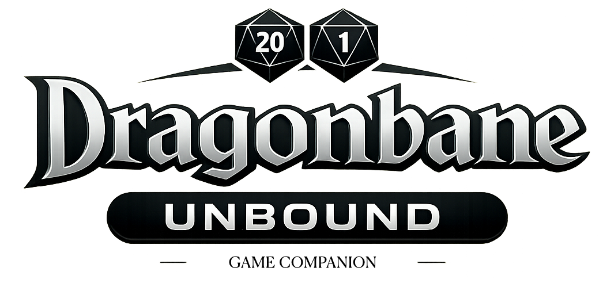

# Package Example (Data-Driven Rules + Content)

This example shows how packages store rules and content as data files. The rules engine reads these files and computes outcomes. The DB stores only state (inputs, choices, results, receipts).

Examples below use actual Dragonbane data from `docs/character_creation/`.

## Example: System Pack Layout

```
packages/
  systems/
    dragonbane-core/
      manifest.json
      tables/
        skill-base-chance.json
        damage-bonus.json
        movement-modifier.json
      rules/
        derived-stats.json
        creation-flow.json
      content/
        kins/
        professions/
        skills/
        spells/
        equipment/
```

### manifest.json

```json
{
  "name": "@dbu/system-dragonbane-core",
  "type": "system",
  "version": "0.1.0",
  "requires": ["@dbu/engine"],
  "description": "Core Dragonbane rules, tables, and content from the base rulebook"
}
```

### tables/skill-base-chance.json

Maps attribute values to base chance for untrained skills. Trained skills double this value.

```json
{
  "id": "skill_base_chance",
  "description": "Attribute value to base chance bracket table",
  "brackets": [
    { "min": 1,  "max": 5,  "base_chance": 3 },
    { "min": 6,  "max": 8,  "base_chance": 4 },
    { "min": 9,  "max": 12, "base_chance": 5 },
    { "min": 13, "max": 15, "base_chance": 6 },
    { "min": 16, "max": 18, "base_chance": 7 }
  ],
  "trained_multiplier": 2
}
```

### tables/damage-bonus.json

Two separate bonuses: one for STR-based weapons, one for AGL-based weapons.

```json
{
  "id": "damage_bonus",
  "description": "Attribute value to damage bonus",
  "brackets": [
    { "min": 1,  "max": 12, "bonus": null },
    { "min": 13, "max": 16, "bonus": "1d4" },
    { "min": 17, "max": 18, "bonus": "1d6" }
  ],
  "applies_to": ["STR", "AGL"]
}
```

### rules/derived-stats.json

```json
{
  "derived": [
    {
      "id": "hp",
      "name": "Hit Points",
      "name_sv": "Kroppspoang",
      "formula": "CON"
    },
    {
      "id": "wp",
      "name": "Willpower Points",
      "name_sv": "Viljepoang",
      "formula": "WIL"
    },
    {
      "id": "movement",
      "name": "Movement",
      "name_sv": "Forflyttning",
      "formula": "kin.base_movement + lookup(tables/movement-modifier.json, AGL)"
    },
    {
      "id": "carrying_capacity",
      "name": "Carrying Capacity",
      "name_sv": "Barformaga",
      "formula": "ceil(STR / 2)"
    },
    {
      "id": "damage_bonus_str",
      "formula": "lookup(tables/damage-bonus.json, STR)"
    },
    {
      "id": "damage_bonus_agl",
      "formula": "lookup(tables/damage-bonus.json, AGL)"
    }
  ]
}
```

### rules/creation-flow.json

The 13-step character creation sequence. Each step defines an action type and its data source.

```json
{
  "steps": [
    {
      "id": "choose_kin",
      "step": 1,
      "action": "choose_or_roll",
      "source": "content/kins/",
      "roll_die": "1d12",
      "output": "header.kin"
    },
    {
      "id": "note_kin_ability",
      "step": 2,
      "action": "auto_derive",
      "input": "header.kin",
      "output": "heroic_abilities_and_spells"
    },
    {
      "id": "choose_profession",
      "step": 3,
      "action": "choose_or_roll",
      "source": "content/professions/",
      "roll_die": "1d10",
      "output": "header.profession"
    },
    {
      "id": "choose_age",
      "step": 4,
      "action": "choose_or_roll",
      "source": "tables/age-categories.json",
      "roll_die": "1d6",
      "output": "header.age"
    },
    {
      "id": "roll_attributes",
      "step": 6,
      "action": "roll_and_assign",
      "dice": "4d6kh3",
      "count": 6,
      "targets": ["STR", "CON", "AGL", "INT", "WIL", "CHA"],
      "post_process": "apply_age_modifiers",
      "output": "attributes"
    },
    {
      "id": "calculate_derived",
      "step": 7,
      "action": "formula_batch",
      "formulaRef": "rules/derived-stats.json",
      "output": "derived_ratings"
    },
    {
      "id": "choose_trained_skills",
      "step": 8,
      "action": "choose_subset",
      "source_profession": 6,
      "source_free": "age.free_choice_slots",
      "table": "tables/skill-base-chance.json",
      "output": "skills"
    }
  ]
}
```

## Example: Expansion Pack Layout

Expansion packs add content from other sourcebooks. They can be toggled independently.

```
packages/
  content/
    monsterbook-kins/
      manifest.json
      kins/
        orc.json
        ogre.json
        goblin.json
        ...
      modifiers/
        nightkin.json
        melancholy.json
      tables/
        expanded-kin-table.json
```

### manifest.json

```json
{
  "name": "@dbu/content-monsterbook-kins",
  "type": "content",
  "version": "0.1.0",
  "requires": ["@dbu/system-dragonbane-core"],
  "description": "9 playable kins from the Dragonbane Monsterbook",
  "source": "DoD_Monsterboken_v1",
  "replaces": {
    "tables/kin-table.json": "tables/expanded-kin-table.json"
  }
}
```

### kins/orc.json

```json
{
  "id": "orc",
  "name": "Orc",
  "name_sv": "Orch",
  "translation_official": true,
  "movement": 10,
  "modifiers": ["nightkin"],
  "ability": {
    "name": "Steadfast",
    "name_sv": "Standfast",
    "translation_official": false,
    "wp_cost": 3,
    "description": "At 0 HP, automatically Rally without needing persuasion or WIL roll."
  },
  "names": ["Mauga", "Muzorg", "Radbag", "Snagrat", "Ug-Gash", "Gor-Nakh"]
}
```

## Example: Third-Party Adventure Pack

Third-party content adds new professions, magic schools, or kins from adventure modules.

```
packages/
  content/
    branda-jorden/
      manifest.json
      professions/
        dark-mage.json
        dark-knight.json
      magic/
        dark-magic.json
```

### manifest.json

```json
{
  "name": "@dbu/content-branda-jorden",
  "type": "content",
  "version": "0.1.0",
  "requires": ["@dbu/system-dragonbane-core"],
  "description": "Dark Mage, Dark Knight professions and Dark Magic school from Den branda jorden",
  "source": "Den_brnda_jorden_231003",
  "translation_official": false
}
```

## What Goes in the DB (State Only)

- **Character state**: Rolled attributes, selected kin/profession/age, trained skills, current HP/WP, conditions, inventory
- **Derived results**: Computed values (movement, damage bonus, skill values) plus a receipt of how they were computed
- **Campaign state**: Encounter order, combat logs, session notes, items owned
- **Installed packs**: List of enabled packages + versions

The DB never stores rules or content definitions — those live in packages. This separation means content can be updated without touching character data, and characters can be validated against any version of the rules.
